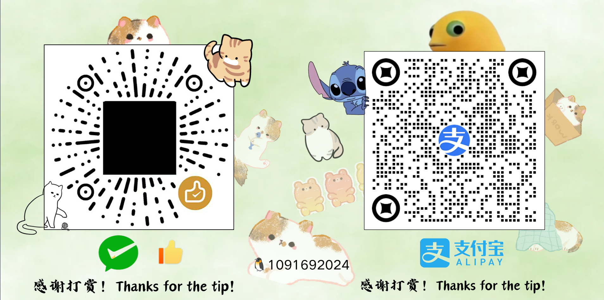

<div align="center">


# ZcodeKnight

**Black Knight Gateway · 黑骑士网关**

**Tired of juggling multiple subscription accounts on one machine — getting logged out every
time you switch, and never knowing which account still has quota?**
**你是否因为多个订阅账号挤在一台电脑上无法同时使用、一切换就掉登录态、也不知道哪个号还有额度而苦恼？**

ZcodeKnight pools every account behind one local endpoint: automatic round-robin,
per-account concurrency gates, cooldown and quota-exhaustion avoidance, live balances,
auto free-quota claiming, and a dark "black knight" web panel — all in your browser.
ZcodeKnight 把所有账号汇总到一个本地接口后面：自动轮询、每账号并发闸门、冷却与额度耗尽避让、
实时余额、自动领取免费额度，以及一个深色黑骑士风格网页面板——全部在浏览器里完成。

<p>
  <a href="https://github.com/YU123-ZZZ/zcodeknight-YU/stargazers"></a>
  <a href="https://github.com/YU123-ZZZ/zcodeknight-YU/forks"></a>
  <a href="https://img.shields.io/github/issues/YU123-ZZZ/zcodeknight-YU"></a>
  <a href="https://github.com/YU123-ZZZ/zcodeknight-YU/blob/master/LICENSE"></a>
  <a href="https://img.shields.io/github/v/release/YU123-ZZZ/zcodeknight-YU"></a>
  <a href="https://github.com/YU123-ZZZ/zcodeknight-YU"></a>
</p>


[English](#english) · [中文](#中文) · [How to use](#how-to-use)

</div>

---

# English

## What is this?

ZcodeKnight is a **local API gateway for GLM coding-plan subscriptions**.

Your GLM subscription (Z.AI / Bigmodel coding plan) normally only works inside the official
ZCode client. ZcodeKnight runs on your own machine and turns that subscription into standard
**OpenAI / Anthropic / Responses** APIs, so Claude Code, Codex CLI, Cherry Studio, Cline,
LobeChat — anything that speaks those protocols — can use your plan directly.

On top of that it solves the problem the official client has: **one machine, one account**.
ZcodeKnight manages a whole **pool of accounts** and spreads requests across them.

## What it does

| Capability | Detail |
| --- | --- |
| **Multi-account pool** | Add any number of accounts. Requests round-robin between them. |
| **Per-account concurrency gate** | The upstream free tier caps concurrency at **3 per account**, and one model — `glm-5.3` — at **1**. Each account gets its own gate, and the per-model ceiling is applied on top. Measured, not guessed — see the table below. |
| **Per-model concurrency ceilings** | Two different limits exist upstream, told apart by their error codes. `3008` = the account-wide ceiling of 3. `3009` = a stricter ceiling on one model. See the measured table below. |
| **Burst absorption** | When every slot is full the pool tries one more request (overflow) and queues the rest for up to 20s, instead of failing a burst that would have succeeded moments later. A losing overflow downgrades that account or model immediately. |
| **Cooldown / exhaustion avoidance** | `429`/`3008`/`3009` → 60s cooldown. Quota signals (`1113`, `402`) → 30-minute hold. `401`/`403` → marked "needs re-login". A dead account never blocks the others. |
| **Three API flavors, one port** | `/v1/chat/completions` (OpenAI), `/v1/messages` (Anthropic), `/v1/responses` (Codex). |
| **Per-account identity** | Every account keeps its own device fingerprint (`X-Device-Mid`) and its own AES-GCM encrypted credential — each looks like a separate desktop client. |
| **Persistent login** | Credentials are encrypted on disk and reloaded on boot. Log in once, stay logged in. |
| **Live balances** | Per-account quota bars in the panel; low balance turns gold. Balances are polled in the background every 5 minutes, so opening the panel costs no upstream round-trips. |
| **Auto free-quota claiming** | Each eligible account can run its own claim scheduler and grab limited plans the moment they open. **Off by default** (`claim.auto: false`) — a claim is a preview + captcha + claim per account, retried forever on a cooldown, so it is manual unless you turn it on. Claim per account, claim all at once, or enable auto in Settings. |
| **Pending-grant visibility** | An activity package that is granted but not yet activated shows as a gold PENDING row with its activation time in local time — instead of looking like a failed claim, which is what an empty balance bar suggests. |
| **Model probing** | Test which models each account can actually use — one tiny request per model. **Off by default and run by hand**: an unattended sweep is ~90 upstream calls for 8 accounts, and those count against the same IP budget as your traffic. |
| **Playground** | Pick an account × model, send a real request, verify the whole chain. |
| **Online update** | Check GitHub releases, download with a progress bar, then restart to apply. Download and apply are separate steps — it never restarts behind your back. |
| **Black-knight web panel** | Dark metal UI, zero CDN, works offline, full EN/中文 switch, served from the engine at `/admin`. |

### Measured concurrency ceilings

Two different limits exist upstream, and their error codes tell them apart.
Measured by firing requests simultaneously at one account and counting how many
return 200:

| model | 3 at once | 5 at once | 8 at once | ceiling |
| --- | --- | --- | --- | --- |
| `glm-5.3-flash` | **3 / 3** | 3 / 5 | 3 / 8 | **3** — above it, `3008` |
| `glm-5.3` | **1 / 3** | 3 / 5 | 3 / 8 | **1** — above it, `3009` |

- **`3008` is the account-wide ceiling (3).** Both models hit it at 5 and 8, which
  is why both settle at 3 there.
- **`3009` is a stricter ceiling on `glm-5.3` alone.** It is the only model that
  returns `3009`, and only when more than one of it runs at once.

So `glm-5.3` allows one request at a time per account while `glm-5.3-flash`
allows three. ZcodeKnight gates per model, so the second `glm-5.3` request
**queues** rather than failing — you wait a moment, you do not get an error.

A single global number cannot express both: set it to 1 and flash loses two
thirds of its capacity; set it to 3 and parallel `glm-5.3` calls break with
`3009`.

**Do not mistake `3009` for a block.** It clears by itself within seconds. If you
see it, the model is not unavailable and the account is not broken — something
else was already using that model on the same account.

### Surviving a burst

The gates are set **at** the measured ceilings — 2 for the account (against a
measured 3, keeping one slot of headroom) and exactly 3 / 1 for the per-model
limits. Headroom is spent by two mechanisms rather than by turning a burst into
errors:

1. **Overflow (account gate only).** When every *account* slot is taken, the
   pool admits requests past that gate up to `overflowFactor × gate` (default
   1.5) instead of refusing. If upstream then rejects one, that account is
   cooled down **immediately** — so a losing bet costs one request, not a retry
   loop. Set the factor to 1 in Settings to disable it and keep strict gating.
   Overflow deliberately never raises a **per-model** ceiling: those encode a
   hard upstream rule (`glm-5.3` refuses a second simultaneous request with
   `3009`), so going past one only earns a rejection plus a cooldown.
2. **Queueing.** A request that still cannot get a slot waits up to 20s for one
   (polling every 250ms) instead of returning `503` at once. Only past that
   budget does the client get `503` with `Retry-After`.

Measured effect, one account pool, requests fired simultaneously:

| burst | before | after |
| --- | --- | --- |
| `glm-5.3-flash` × 6 | 5/6 | **6/6** |
| `glm-5.3` × 3 | 1/3 | **3/3** |
| `glm-5.3` × 6 | — | **6/6** |

Beyond the overflow allowance a burst still queues and then fails, which is the
intended limit: the pool would rather answer honestly than pile an unbounded
load onto one account. Add accounts for more real parallelism — the ceilings are
enforced per account upstream.

**A model collision is held for seconds, not a minute.** An account-wide
rejection (`429`/`3008`) cools the account for `cooldownMs` (60s) because the
credential needs time to settle. A model-scoped `3009` is different: it means
one other request is already running on that model, a condition that ends when
that request ends. It holds only that model, and only for `modelCooldownMs`
(default 5s). Holding it for the full account cooldown is what made a busy model
look permanently rate-limited under load.

**All of these are editable in Settings and persist to `config.yaml`**, so your
tuning survives a restart. (Earlier builds kept them in memory only: the panel
showed your values back and then silently reverted them on the next boot.)

**If you see `captcha_solver_failed`**, that is the start-plan captcha pool under
sustained load, not the model or the account. It clears as the pool refills.

### Quota expiry

An account's daily allowance is not permanent. Upstream reports an `endsAt`
on the plan, and once it passes the allowance is gone:

- **Start Plan** — roughly **4 days** after registration. An account registered
  09-22 carries `endsAt` 09-26 23:59:59.
- **Activity packages** (e.g. "ZCode Global Build") have their own, usually much
  shorter, window — hours to a day.

The panel shows each plan's remaining time with a live countdown, turning amber
within the last day, so the drop to zero does not come as a surprise.

## How it's built

**Stack:** TypeScript engine (running on a bundled Bun runtime) + a single-file HTML panel.
No Python, no pip, no build step, no database server.

```
ZcodeKnight-YU/
├── ZcodeKnight.exe         self-contained executable (Bun runtime compiled in)
├── ZcodeKnight.bat         one-click start (Windows)
├── stop.bat                stop the engine (Windows)
├── setup.sh                one-click deploy (Linux / macOS)
├── setup.bat               first run: fetch the Bun runtime (source mode only)
├── config.yaml             configuration
├── logo.svg                project mark (single source: panel, login, tab icon)
├── data/                   runtime state (encrypted account store, update staging) — not committed
└── server/
    ├── package.json
    └── src/
        ├── index.ts        entry: serve / auth / claim
        ├── paths.ts        in-project state paths (all writes land in data/)
        ├── auth/           account store · pool · multi-account manager
        ├── proxy/          request pipeline (translate, sign, route, stream)
        ├── server/         HTTP routes + admin panel (admin.txt)
        ├── quota/          background balance polling
        ├── update/         online update (check / download / swap)
        ├── claim/          auto free-quota claiming
        └── provider/       model catalog + provider endpoints
```

**The container and the desktop build never share state.** The container writes
to `docker/data` and `docker/config`; the local engine uses the project's own
`./data`. That separation is not cosmetic:
the account store is read into memory at startup and rewritten *whole* on every
change, so two engines on one file do not merge — whichever writes last wins and
the other's accounts disappear without an error.

**Request flow:**

```
client (Claude Code / Codex / …)
   │  standard OpenAI or Anthropic request
   ▼
┌─ ZcodeKnight engine ────────────────────────────────┐
│ 1. auth gate      proxyApiKey check                 │
│ 2. account pool   pick an eligible account (lease)  │
│ 3. identity       inject that account's deviceMid   │
│ 4. translate      OpenAI ⇄ Anthropic as needed      │
│ 5. sign           client-signing handshake headers  │
│ 6. route          endpoint-routing table            │
│ 7. dispatch       POST upstream, stream back        │
│ 8. report         success / cooldown / exhausted    │
└─────────────────────────────────────────────────────┘
   │
   ▼
upstream (api.z.ai / open.bigmodel.cn)
```

**Key design decisions:**

- **The lease model.** `AccountPool.acquire()` returns a lease synchronously from in-memory
  state — no `await` between the eligibility check and the counter increment, so two
  concurrent requests can never take the same slot. The lease is held until a *streaming*
  response finishes draining, matching the upstream's own accounting.
- **Per-account identity, not global.** The `plan`, `provider` and `deviceMid` used for a
  request come from the *account record*, not from global config. That is what makes N
  accounts on one machine look like N separate desktop clients.
- **Encrypted account store.** `~/.zcode-knight/accounts.json` is AES-GCM encrypted
  (SHA-256 KDF over the machine seed, or `ZCODE_KNIGHT_CREDENTIAL_SECRET`). Set that env
  var to a fixed value to move the file between machines. Copy a store to a machine that
  cannot decrypt it — a different user name, since the default seed contains the home
  directory — and the engine does not fail or overwrite: it renames the file to
  `accounts.json.unreadable-<timestamp>` and starts with no accounts, so nothing is lost
  and the log says exactly what happened.
- **Zero-dependency panel.** The whole admin UI is one HTML file with inline CSS/JS, no CDN,
  no framework — it works with no internet connection.

## How to use

### 1. Start

```bat
:: Windows — double-click, or run:
ZcodeKnight.bat
```

```bash
# Linux / macOS — one command, no prerequisites
sh setup.sh
```

#### Stopping it (Windows)

```bat
stop.bat
```

The engine is compiled with `--windows-hide-console`: it has no window, no tray
icon and nothing on the taskbar, and `ZcodeKnight.bat` exits as soon as it has
opened the panel. So there is no window to close — `stop.bat` is the way to stop
it. It lists what it found and asks before doing anything:

```
  Found 1 running engine(s):

  PID 25216  ZcodeKnight.exe   listening  127.0.0.1:17800
        C:\ZcodeKnight\ZcodeKnight.exe

  Stop the engine(s) above? (y/N)
```

`stop.bat /y` skips the prompt for use from another script. Two details worth
knowing, both of which were bugs before they were features:

- **Engines are found by which process is LISTENING on a loopback port**, not by
  name. `server\runtime.exe` is Bun itself and carries that name while the test
  suite runs; only the listening one is an engine, so matching on the port cannot
  kill a test run by accident. Image names are matched loosely (anything
  containing `ZcodeKnight`, plus `runtime.exe`) because builds and rollbacks
  legitimately produce other names.
- **It re-checks instead of trusting `taskkill`.** A non-elevated shell makes
  `taskkill` fail, and reporting success from its exit code would leave you
  thinking the port was free — then starting a second engine on the same account
  store, which is the one situation that silently loses accounts.

If it reports that engines are still running, re-run it as Administrator.
Stopping is safe: the account store is written atomically on every change, not
on exit.

```bash
# Linux / macOS equivalent
sh setup.sh --stop
sh setup.sh --status
```

`setup.sh` is idempotent and self-contained: it finds a Bun runtime (system
install, or downloads a pinned one if absent), compiles the engine, and starts it
in the background. Re-running it reuses what the first run produced — the compile
is skipped while the binary is newer than the sources.

```bash
sh setup.sh --foreground   # run in this terminal (Ctrl-C to stop)
sh setup.sh --status       # is it running?
sh setup.sh --stop         # stop the background instance
```

It needs `curl` or `wget` plus `unzip` **only** if Bun is not already installed;
on a machine that has Bun, nothing is downloaded. The compiled engine itself has
no runtime dependencies beyond the C library — `ca-certificates` is already
required by every OS for the HTTPS calls it makes.

The engine starts and the panel opens at **http://127.0.0.1:17800/admin**.

#### Or run it in Docker

The whole Docker deployment lives in `docker/` — one folder holding the
Dockerfile, the compose file and (after the first run) all of its state. The
web version is unaffected; the two never share a store.

```bash
cd docker
docker compose up -d          # build + start
docker compose logs -f        # follow the engine log
docker compose down           # stop (state stays in docker/)
```

Then open **http://127.0.0.1:17800/admin**. First run needs no manual step: the
engine writes its template config into `docker/config/` and generates a device
identity automatically.

**The container keeps its state separate from the local run.** Everything it
writes lives under `./docker/` — one directory you can archive, move or delete
as a unit. The local (non-Docker) engine keeps using `./data`,
so the two never touch the same files.

That separation is not cosmetic. The account store is an encrypted file that each
process reads into memory at startup and rewrites *whole* on every change. Two
engines pointed at one file do not merge: whichever writes last wins, and the
other's account additions and deletions disappear with no error. Running both
against `./data` would eventually lose accounts.

**How the container is laid out**

| Path (container) | Path (host) | What it holds |
| --- | --- | --- |
| `/app/ZcodeKnight` | — (baked into the image) | The engine, compiled for the image's architecture |
| `/app/config/` | `./docker/config/` | `config.yaml`. A **directory** mount on purpose — see below |
| `/app/data/` | `./docker/data/` | Encrypted account store, probe results |

**Why the config is a directory mount.** Mounting a single file that does not
exist yet makes Docker create a *directory* at that path, and the engine then
fails to read it as a file. A directory mount always works, and the engine fills
in its template config on first boot. Edit `./docker/config/config.yaml` on the
host and restart to change settings.

**Why the port is bound to `127.0.0.1`.** The panel holds every account
credential. Publishing it on the host loopback means it is reachable from this
machine only — and that bind, not the key, is what protects it. The engine
accepts `admin` as a built-in fallback key *even when* `config.yaml` sets a real
`proxyApiKey` (a deliberate recovery path, asserted by a test in
`panel-session.test.ts`). So changing the mapping to `17800:17800` exposes the
panel to anyone who can reach the port and tries the documented default. Leave it
on loopback unless you have a reason not to.

**How the image is built.** Two stages: a `oven/bun` stage compiles the engine
into one self-contained binary for the *target* architecture (so an arm64 image
builds correctly on an amd64 machine), then a `debian-slim` stage carries just
that binary plus `ca-certificates` (every upstream call is HTTPS) and `curl`
(for the healthcheck). The `.dockerignore` keeps `data/` and
`config/` out of the build context.

**`docker/` is self-contained.** Everything the build needs — `src/`,
`package.json`, `bun.lock`, `bunfig.toml` — is generated *into* this folder by
`server/scripts/prepare-docker.ts`, so the build context is `docker/` itself and
the folder can be copied to any machine with Docker. Those copies are generated:
edit the engine sources and re-run the script (the clean-copy build does it for
you), never the copies inside `docker/`.

**What is inside the binary and what is not.** The panel HTML
(`server/src/admin.txt`, `webui.txt`) and the system-prompt sidecar
(`proxy/zcode_system.json`) are text/JSON imports, so Bun inlines them at compile
time — a binary-only image serves a complete, working panel with no source tree
beside it. Two assets are read from disk instead, and the Dockerfile copies them
only when the tree has them: `logo.svg` (the panel mark) and `docs/` (the donate
QR). Both are absent from the clean copy, whose panel is rewritten to text-only
branding — so its Dockerfile carries neither `COPY`, and a build there cannot
fail on a missing file.

**Keeping the container in step with the engine.** `docker/src/` is a *copy* of
`server/src/`, so it can go stale: fix something in the engine, rebuild the
image, and the container keeps running the old code with nothing to warn you.
After changing engine sources, regenerate the folder:

```bash
cd server
bun run scripts/prepare-docker.ts     # refresh docker/ from the current sources
```

`bun test` catches the drift for you — `server/src/server/docker-sync.test.ts`
compares the two trees file by file and fails on any missing, extra or differing
file, so a forgotten regeneration is a test failure rather than a surprise in
production.

**Concurrency inside a container.** The pool's gates apply unchanged — 2 per
account and 3 / 1 per model (see [Measured concurrency ceilings](#measured-concurrency-ceilings)).
Two container-specific notes:

- **More accounts, not a higher limit.** The ceiling is enforced upstream per
  account, so raising `maxConcurrentPerAccount` past 3 only produces `3008`. Add
  accounts to get more parallelism. The overflow and queueing described under
  [Surviving a burst](#surviving-a-burst) work the same way in a container.
- **Settings persist into the container's own `config.yaml`.** Tuning saved from
  the panel is written to `docker/config/config.yaml` and applied on the next
  start, so `docker compose restart` keeps it.
- **A container normally shares the host's IP**, and so does everything else on
  that machine. Risk control counts per address, so every request the engine
  makes unattended spends from the same budget as your traffic. That is why the
  probe sweep is off by default.

### 2. Log in to the panel

Enter your admin key — that is the `auth.proxyApiKey` value from `config.yaml`.

The key is exchanged once for an HttpOnly session cookie, so it does not sit in
browser storage afterwards. See [Panel security](#panel-security) for what that
does and does not protect against.

### 3. Add accounts

**Accounts → + Add account** → choose a provider (Z.AI international / Bigmodel China) →
give it an alias → **Generate authorize link** → open the link in any browser (phone works)
→ authorize → the account appears in the pool automatically. Repeat for as many accounts as
you have.

### 4. Point your tools at it

| Tool | Base URL | API Key | Model |
| --- | --- | --- | --- |
| Claude Code | `http://127.0.0.1:17800` | your proxyApiKey | `glm-5.3-flash` |
| Codex CLI | `http://127.0.0.1:17800/v1` | your proxyApiKey | `glm-5.3-flash` |
| OpenAI-compatible | `http://127.0.0.1:17800/v1` | your proxyApiKey | `glm-5.3-flash` |

### 5. Panel pages

| Page | What for |
| --- | --- |
| **Overview** | Account count, eligible count, in-flight requests, total requests, per-account balance bars, pending grants, claim buttons (per account + claim all) |
| **Accounts** | Account cards: provider, plan, status, concurrency, requests, failures. Pause / enable / clear cooldown / re-login / delete |
| **Playground** | Pin an account × model, send a real request, see streaming output |
| **Logs** | Live request log |
| **Model Probe** | Test which models an account can actually use |
| **Settings** | Endpoint, key, gate size, cooldown, per-account spacing, auto-claim toggle, online update |

### 6. CLI (optional)

```bash
runtime.exe run src/index.ts --cli serve [config.yaml]   # headless
runtime.exe run src/index.ts --cli auth login zai        # CLI login
runtime.exe run src/index.ts --cli claim now             # manual claim
```

## Configuration

`config.yaml` holds the essentials; the panel covers the rest.

| Key | Meaning | Default |
| --- | --- | --- |
| `server.host` / `server.port` | Listen address / port | `127.0.0.1` / `17800` |
| `auth.proxyApiKey` | Client key **and** panel key | — |
| `provider` / `plan` | Default upstream for new accounts | `zai` / `coding-plan` |
| `defaultModel` | Default model | `glm-4.6` |
| `identity.deviceMid` | Per-install device identity sent upstream | auto-generated |

Environment overrides: `ZCODE_PROXY_PORT`, `ZCODE_PROXY_API_KEY`, `ZCODE_PROVIDER`,
`ZCODE_KNIGHT_STORE_DIR` (account store location),
`ZCODE_KNIGHT_CREDENTIAL_SECRET` (fixed encryption seed — for moving accounts between machines).

## Panel security

The panel is the highest-value surface in this project: it holds every account
credential and can drive every upstream call. Three properties matter, and each
is implemented deliberately.

### The key is exchanged for an HttpOnly cookie

You type the admin key once. The panel `POST`s it to `/admin/api/login` and gets
back an **HttpOnly session cookie** plus a CSRF token.

*What this buys:* the key is no longer kept in `sessionStorage`, which is
readable by JavaScript. If someone lands an XSS on the panel, they can still act
as you for the life of the page — but they **cannot read the key out** and reuse
it elsewhere.

*What it does not buy:* protection from XSS itself. A cookie is sent
automatically, so script running on the page can make authenticated requests.
Keep the panel on a trusted network.

### State-changing requests need a CSRF token

A cookie rides along on *any* request the browser makes to this origin,
including one triggered by a page you happen to visit. So every `POST` from a
cookie-authenticated session must also carry an `X-CSRF-Token` header matching
the value the login returned. Requests without it get `403 csrf_failed`.

*Why header auth is exempt:* a browser cannot attach a `Bearer` header to a
cross-origin request, so the header path is CSRF-immune by construction.
Demanding a CSRF token there would break every script for no security gain —
which is why `curl`, the CLI and your tools keep working unchanged.

### Failed logins are rate limited

8 failed attempts from one IP → a 15-minute lockout, checked *before* the key
comparison so a locked-out attacker cannot keep burning CPU on guesses. A
successful login clears the record. This matters because the documented
fresh-install key is `admin` — change it before exposing the panel.

| Credential | Use case | CSRF required | Rate limited |
| --- | --- | --- | --- |
| HttpOnly session cookie | The panel UI | Yes (writes only) | — |
| `Authorization: Bearer <key>` | Scripts, CLI, curl | No | — |
| `X-Admin-Key: <key>` | Same, older clients | No | — |
| `POST /admin/api/login` | Obtaining a session | — | Yes |

Sessions live in memory only, so restarting the engine logs everyone out. That
is the right default for a self-hosted panel — there is no session database to
steal.

## FAQ

**Why do I get `429` / "concurrency limit exceeded"?**
Two different limits. `3008` is the account-wide ceiling (3 concurrent requests);
ZcodeKnight gates each account at that limit and spreads a burst across accounts.
`3009` is a stricter limit on `glm-5.3` alone — it allows **one** request per
account at a time, so a second parallel `glm-5.3` call is refused. ZcodeKnight
queues that one rather than failing it. **`3009` is not a block**: it clears
within seconds and does not mean the model or the account is unavailable.

**Why did my daily quota disappear after a few days?**
It has an expiry. Upstream puts an `endsAt` on the plan — about **4 days** for a
Start Plan — and after that the daily allowance is gone. It is a FIXED deadline,
not "registration + 4 days": three accounts registered at different times on
09-22 all carry `endsAt` 09-26 23:59:59, so the later you register the fewer days
you actually get (measured spans: 4.16–4.51 days). Activity packages expire on
their own, much sooner (measured: ~19 hours, ending on a round hour). The panel
counts down to each plan's end and turns amber in the final day.

**A request failed with `credential_unavailable`?**
Every account was busy, cooling down, exhausted, or needs re-login. The panel shows each
account's state; the response carries `Retry-After` when a cooldown is about to expire.

**Do I have to log in again after restarting?**
No. Credentials persist. Use a fixed `ZCODE_KNIGHT_CREDENTIAL_SECRET` to move them between
machines.

## Disclaimer

**This project is fully open source and free of charge — anyone charging money is a scammer.**
Please rely on the author's official releases only. In the spirit of open source, and subject
to applicable laws, the author's notices and third-party licenses, you are welcome to
download, study, modify and further develop it. When redistributing, keep the relevant
disclaimers in the code and on the pages intact, and do not pass off a modified build as the
author's official release.

There is no official paid version. Anyone asking for an installation fee, license fee,
"labor" fee, technical-service fee or any other payment is not authorized by this project.

The author's official release form is the open-source repository on GitHub and the 52pojie
profile. Except for what the author publishes there, any desktop software, installer,
mobile app, browser extension, mirror site or service offered under this project's name is
not the author's official work and carries no official support.

**Attribution (keep these intact in any redistribution):** author
[YU123-ZZZ](https://github.com/YU123-ZZZ) · 52pojie
[profile](https://www.52pojie.cn/home.php?mod=space&uid=2394304).

Whether this complies with the Z.ai / Zhipu terms of service is yours to confirm. The
consequences of multi-account use — risk control, quota decisions, bans — are the user's to
bear.

For personal-account learning and research use only. Use it in accordance with the service
provider's terms. The authors are not responsible for account restrictions, data loss, or any
other consequences arising from use of this project. You are responsible for the accounts you
add.

This project collects nothing and uploads nothing.

Using it means you have read and accepted the above. The author accepts no liability for any
direct or indirect loss caused by use of this project.

## Support

If this project helps you, you can buy the author a coffee ☕



## License

[MIT](LICENSE) © 2026 YU123-ZZZ

---

# 中文

## 这是什么

ZcodeKnight 是一个 **GLM 编程套餐的本地 API 网关**。

你的 GLM 订阅（Z.AI / 智谱 Bigmodel 编程套餐）本来只能在官方 ZCode 客户端里用。
ZcodeKnight 跑在你自己电脑上，把这份订阅变成标准的 **OpenAI / Anthropic / Responses**
接口，于是 Claude Code、Codex CLI、Cherry Studio、Cline、LobeChat——任何支持这些协议的
工具——都能直接用上你的套餐。

在此之上，它解决了官方客户端的痛点：**一台机器只能登一个号**。
ZcodeKnight 管理一整个**账号池**，把请求分摊到多个账号上。

## 它能做什么

| 能力 | 说明 |
| --- | --- |
| **多账号池** | 想加多少账号都行，请求在账号间轮询分发 |
| **每账号并发闸门** | 上游免费额度**每账号并发上限 3**，而 `glm-5.3` 这个模型**单独限制为 1**。每个账号一个闸门，模型级上限叠加在它之上。下表是实测数据，不是猜的 |
| **模型级并发上限** | 上游有**两个不同**的限制，靠错误码区分：`3008` = 账号级上限 3；`3009` = 某个模型更严的上限。见下方实测表 |
| **突发吸收** | 槽位占满时，池子会先多放行一个请求（超限），其余排队最多 20 秒——而不是把本可以稍后成功的并发直接判失败。超限赌输就立即降级该账号或模型 |
| **冷却 / 耗尽避让** | `429`/`3008`/`3009` → 冷却 60 秒；额度信号（`1113`、`402`）→ 持有 30 分钟；`401`/`403` → 标记「需重登」。一个号挂了不影响其它号 |
| **三种协议一个端口** | `/v1/chat/completions`（OpenAI）、`/v1/messages`（Anthropic）、`/v1/responses`（Codex） |
| **每账号独立身份** | 每个账号有自己的设备指纹（`X-Device-Mid`）和自己的 AES-GCM 加密凭证——各自看起来就像一台独立的桌面客户端 |
| **永久保留登录态** | 凭证加密落盘、重启自动加载。登录一次，一直有效 |
| **实时余额** | 面板上每个账号一条余额进度条，余额偏低变金色。余额由后台每 5 分钟轮询一次，打开面板不再触发上游请求 |
| **自动领取免费额度** | 默认**关闭**（`claim.auto: false`），需要时手动领。可单账号领、一键全领，也可在设置里打开自动 |
| **待生效额度可见** | 活动包已到账但未生效时，会显示一条金色「待生效」行和本地生效时间——否则空余额条看起来就像领取失败了 |
| **模型探测** | 逐个微请求测出每个账号实际能用哪些模型。**默认关闭、手动运行**：8 个账号一次全量探测约 90 个上游请求，而这些都算在你的 IP 预算里 |
| **内置测试页** | 指定账号 × 模型发真实请求，验证整条链路 |
| **在线更新** | 检查 GitHub 发行版、带进度条下载、重启应用。下载和应用是两步，绝不会背着你重启 |
| **黑骑士网页面板** | 深色金属质感 UI，零 CDN、断网可用、中英切换，由引擎直接挂在 `/admin` |

### 并发上限实测

上游有**两个不同**的限制，靠错误码区分。实测方法：对同一个账号同时发请求，数有多少个返回 200。

| 模型 | 同时 3 个 | 同时 5 个 | 同时 8 个 | 上限 |
| --- | --- | --- | --- | --- |
| `glm-5.3-flash` | **3 / 3** | 3 / 5 | 3 / 8 | **3** —— 超过报 `3008` |
| `glm-5.3` | **1 / 3** | 3 / 5 | 3 / 8 | **1** —— 超过报 `3009` |

- **`3008` 是账号级上限（3）**。两个模型在并发 5 和 8 时都撞它，所以都停在 3。
- **`3009` 是 `glm-5.3` 独有的更严限制**。只有它返回 `3009`，而且只在同时跑两个以上时出现。

也就是说：**`glm-5.3` 每个账号同时只能跑 1 个，`glm-5.3-flash` 能跑 3 个。**
ZcodeKnight 按模型设闸门，所以第二个 `glm-5.3` 请求会**排队等待**而不是报错——你等一会儿，不会拿到错误。

用一个全局数字表达不了这两个限制：设成 1，flash 就只剩三分之一的能力；设成 3，并行的 `glm-5.3` 就会报 `3009`。

**不要把 `3009` 当成"模型被封"。** 它几秒内自己就恢复。看到它说明模型可用、账号也没问题，只是同一账号上有另一个请求正在用这个模型。

### 高并发怎么撑住

闸门设在实测上限**本身**——账号级 2（实测 3，留一个槽位余量），模型级就是实测的 3 / 1。余量用两个机制花掉，而不是把并发变成报错：

1. **超限（Overflow，只作用于账号级闸门）**：所有**账号**槽位占满时，池子按 `超限倍数 × 闸门`（默认 1.5）**再放行**，而不是直接拒绝。如果上游拒绝，那个账号**立即进冷却**——赌输只损失一个请求，不会变成重试循环。设置里把倍数设成 1 就关掉，回到严格闸门。超限**故意不作用于模型级上限**：那是上游的硬规则（`glm-5.3` 同时跑第二个请求就返回 `3009`），放过去只会换来一次拒绝加一段冷却。
2. **排队（Queueing）**：还是拿不到槽位的请求会**等最多 20 秒**（每 250ms 轮询一次），而不是立刻返回 `503`。只有超过这个预算才给客户端 `503` 加 `Retry-After`。

实测效果（同一个账号池，请求同时发出）：

| 并发场景 | 修改前 | 修改后 |
| --- | --- | --- |
| `glm-5.3-flash` × 6 | 5/6 | **6/6** |
| `glm-5.3` × 3 | 1/3 | **3/3** |
| `glm-5.3` × 6 | — | **6/6** |

超过超限额度后，并发仍会排队然后失败——这是有意的上限：池子宁愿如实回答，也不愿把无上限的负载堆到一个账号上。**要更多真实并发就多添加账号**，因为上限是上游按账号卡的。

**模型级冲突只冷却几秒，不是一分钟。** 账号级拒绝（`429`/`3008`）让账号冷却 `cooldownMs`（60 秒），因为这个凭证需要时间缓过来。模型级 `3009` 是另一回事：它表示**这个模型上已经有一个请求在跑**，那个请求结束冲突就没了。所以它只冷却那一个模型，而且只冷却 `modelCooldownMs`（默认 5 秒）。按账号冷却那么久，正是「一高并发模型就一直显示被限流」的原因。

**上面这些都能在设置页改，而且现在会写进 `config.yaml`**，重启不丢。（早期版本只存在内存里：面板把你的值显示回来，重启后又悄悄恢复默认。）

**如果看到 `captcha_solver_failed`**，那是 start-plan 的验证码池在持续负载下的表现，不是模型或账号的问题，池子补充后就会恢复。


### 额度到期

账号的每日额度**不是永久的**。上游在套餐上带一个 `endsAt`，过了这个时间额度就没了：

- **Start Plan** —— 大约 **4 天**。注意它**不是**「注册时间 + 4 天」，而是一个**固定截止时刻**：实测三个不同时间注册的账号（09-22 的 11:45、14:13、20:03），`endsAt` 全部落在 **09-26 23:59:59**。所以越晚注册，实际能用到的天数越少（实测跨度 4.16～4.51 天）。
- **活动包**（比如「ZCode Global Build」）有自己的窗口，短得多——实测约 19 小时，同样结束在一个整点（09-23 09:00:00）。

面板会给每个套餐显示实时倒计时，最后一天变琥珀色，这样额度归零不会来得莫名其妙。

## 怎么做的

**技术栈：** TypeScript 引擎（跑在自带的 Bun 运行时上）+ 单文件 HTML 面板。
没有 Python、没有 pip、不用编译、不用数据库。

```
ZcodeKnight/
├── ZcodeKnight.exe         自包含可执行文件（Bun 运行时已编译进去）
├── ZcodeKnight.bat         一键启动（Windows）
├── stop.bat                停止引擎（Windows）
├── setup.sh                一键部署（Linux / macOS）
├── setup.bat               首次运行：拉取 Bun 运行时（仅源码模式需要）
├── config.yaml             配置文件
├── logo.svg                项目标识（唯一来源：面板 / 登录页 / 标签页图标）
├── data/                   运行期状态（加密账号库、更新暂存）—— 不入库
└── server/
    ├── package.json
    └── src/
        ├── index.ts        入口：serve / auth / claim
        ├── paths.ts        项目内状态路径（所有落盘都收在 data/）
        ├── auth/           账号存储 · 账号池 · 多账号管理
        ├── proxy/          请求管线（转换、签名、路由、流式）
        ├── server/         HTTP 路由 + 管理面板（admin.txt）
        ├── quota/          余额后台轮询
        ├── update/         在线更新（检查 / 下载 / 换文件）
        ├── claim/          自动领取免费额度
        └── provider/       模型目录 + 上游端点
```

**容器和本机版永不共享状态。** 容器写 `docker/data` 和 `docker/config`；
本机直接跑的引擎用项目自己的 `./data`。
这个隔离不是摆设：账号库在启动时被读进内存、每次改动**整体重写**，所以两个引擎
指向同一个文件不会合并——后写的赢，另一边的账号无声消失。

**请求流程：**

```
客户端（Claude Code / Codex / …）
   │  标准 OpenAI 或 Anthropic 请求
   ▼
┌─ ZcodeKnight 引擎 ─────────────────────────────────┐
│ 1. 鉴权     校验 proxyApiKey                        │
│ 2. 账号池   选一个可用账号（发租约）                │
│ 3. 身份     注入该账号自己的 deviceMid              │
│ 4. 转换     OpenAI ⇄ Anthropic 按需转换             │
│ 5. 签名     客户端签名握手头                        │
│ 6. 路由     端点路由表                              │
│ 7. 派发     POST 上游，流式回传                     │
│ 8. 回报     成功 / 冷却 / 耗尽                      │
└─────────────────────────────────────────────────────┘
   │
   ▼
上游（api.z.ai / open.bigmodel.cn）
```

**关键设计：**

- **租约模型。** `AccountPool.acquire()` 从内存状态**同步**返回租约——可用性检查和计数器
  自增之间没有 `await`，所以两个并发请求绝不可能抢到同一个槽位。租约持有到**流式**响应
  读完才释放，与上游自己的并发计数方式一致。
- **身份跟着账号走，不是全局的。** 一次请求用的 `plan`、`provider`、`deviceMid` 都取自
  **账号记录**，不是全局配置。这才是让同一台机器上的 N 个账号看起来像 N 台独立客户端的
  关键。
- **加密账号存储。** `~/.zcode-knight/accounts.json` 用 AES-GCM 加密（基于机器种子的
  SHA-256 KDF，或 `ZCODE_KNIGHT_CREDENTIAL_SECRET`）。把该环境变量设成固定值，就能把
  账号文件搬到另一台机器继续用。如果搬过去的机器解不开（默认种子含主目录，换了用户名
  就解不开），引擎**不会报错退出、也不会覆盖**：它把文件改名成
  `accounts.json.unreadable-<时间戳>` 后以零账号启动，什么都没丢，日志里写清了原因。
- **零依赖面板。** 整个管理界面是一个 HTML 文件，内联 CSS/JS，不用 CDN、不用框架，
  断网也能开。

## 如何使用

### 1. 启动

```bat
:: Windows —— 双击，或命令行运行：
ZcodeKnight.bat
```

```bash
# Linux / macOS —— 一条命令，无需预装任何东西
sh setup.sh
```

#### 怎么停止（Windows）

```bat
stop.bat
```

引擎是用 `--windows-hide-console` 编译的：没有窗口、没有托盘图标、任务栏上也看不到，
而且 `ZcodeKnight.bat` 打开面板后就自己退出了。所以**没有窗口可以关**——`stop.bat`
就是那个入口。它会先列出找到的引擎再问你：

```
  Found 1 running engine(s):

  PID 25216  ZcodeKnight.exe   listening  127.0.0.1:17800
        C:\ZcodeKnight\ZcodeKnight.exe

  Stop the engine(s) above? (y/N)
```

`stop.bat /y` 跳过询问，给别的脚本调用。两个细节都是踩过坑才这么写的：

- **按「哪个进程在监听本机回环端口」认引擎，不按名字。** `server\runtime.exe` 就是
  Bun 本身，跑测试时也是这个名字；只有"在监听"的那个才是引擎，所以按端口认不会误
  杀一次正在跑的测试。镜像名是**宽松匹配**的（名字里含 `ZcodeKnight`，或者
  `runtime.exe`），因为构建和回滚会产生别的名字——早先写死两个名字的版本就漏掉过一
  个真实存在的 `ZcodeKnight-new.exe`。
- **停完会复查，不信任 `taskkill` 的返回码。** 没有管理员权限时 `taskkill` 会直接失
  败，如果按返回码报"完成"，你会以为端口空了——然后启动第二个引擎，而**两个引擎共
  用一个账号库正是会静默丢账号的那种情形**。

如果它说还有引擎在跑，用管理员身份再运行一次。停止是安全的：账号库每次改动都立刻
原子写入磁盘，不是退出时才保存。

```bash
# Linux / macOS 对应命令
sh setup.sh --stop
sh setup.sh --status
```

`setup.sh` 可重复运行、自带依赖：它会找一个 Bun 运行时（本机已装就用本机的，
没有就下载一个固定版本），编译引擎，然后后台启动。再跑一次会复用上次的产物——
只要二进制比源码新就跳过编译。

```bash
sh setup.sh --foreground   # 前台运行（Ctrl-C 停止）
sh setup.sh --status       # 在跑吗
sh setup.sh --stop         # 停止后台实例
```

只有在**本机没有 Bun** 时才需要 `curl`（或 `wget`）和 `unzip`；有 Bun 的机器
什么都不下载。编译出来的引擎除了 C 库之外没有运行时依赖——它要发 HTTPS 请求，
而 `ca-certificates` 任何系统本来就有。

引擎启动后，面板会自动在 **http://127.0.0.1:17800/admin** 打开。

#### 或者用 Docker 跑

整套 Docker 部署都在 `docker/` 里——一个文件夹装着 Dockerfile、compose 文件，
以及首次运行后产生的全部状态。网页版不受影响，两者不共用任何存储。

```bash
cd docker
docker compose up -d          # 构建并启动
docker compose logs -f        # 跟随引擎日志
docker compose down           # 停止（状态保留在 docker/）
```

然后打开 **http://127.0.0.1:17800/admin**。首次启动**不需要手工准备任何文件**：
引擎会把自己的模板配置写进 `docker/config/`，并自动生成设备身份。

**容器与网页版分开存放。** 容器写的东西全部落在 `./docker/` 一个目录里，可以整体
归档、搬走或删除；本机直接跑（非 Docker）仍然用 `./data`，
两边不碰同一批文件。

这个隔离不是洁癖。账号库是一个加密文件，每个进程启动时读进内存、**每次改动整文件
重写**。两个引擎指向同一份文件不会合并：谁后写谁覆盖，另一边的增删账号会无声消失。
两边都用 `./data` 的话，迟早丢账号。

**容器目录怎么对应**

| 容器内路径 | 宿主机路径 | 装什么 |
| --- | --- | --- |
| `/app/ZcodeKnight` | —（编译进镜像） | 引擎本体，按镜像架构编译 |
| `/app/config/` | `./docker/config/` | `config.yaml`。**故意用目录挂载**，原因见下 |
| `/app/data/` | `./docker/data/` | 加密账号库、模型探测结果 |

**为什么配置用目录挂载而不是文件挂载。** 挂载一个**尚不存在**的单个文件时，
Docker 会在那个路径上创建一个**目录**，引擎再按文件读就会失败。目录挂载永远可用，
引擎首次启动会把模板配置写进去。改配置就在宿主机上编辑
`./docker/config/config.yaml`，然后重启容器。

**为什么端口绑在 `127.0.0.1`。** 面板持有全部账号凭证，只发布到宿主机回环，
意味着只有本机能访问——**真正保护它的是这个绑定，不是密钥**。引擎即使
`config.yaml` 里设了真正的 `proxyApiKey`，也仍然接受 `admin` 这个内置兜底密钥
（这是故意留的找回通道，`panel-session.test.ts` 里有测试固定它）。所以把映射改成
`17800:17800` 就等于把面板暴露给任何能连上该端口、并试一下文档里默认值的人。
除非有明确理由，否则就留在回环上。

**镜像是怎么构建的。** 两个阶段：`oven/bun` 阶段把引擎编译成**目标架构**的自包含
二进制（所以 arm64 镜像能在 amd64 机器上正确构建），`debian-slim` 阶段只带那个
二进制加 `ca-certificates`（所有上游调用都是 HTTPS）和 `curl`（健康检查用）。
`.dockerignore` 把 `data/`、`config/` 挡在构建上下文外。

**`docker/` 是自包含的。** 构建需要的东西——`src/`、`package.json`、`bun.lock`、
`bunfig.toml`——都由 `server/scripts/prepare-docker.ts` **生成到**这个文件夹里，
所以构建上下文就是 `docker/` 本身，整个文件夹复制到任何装了 Docker 的机器都能构建。
这些文件是**生成物**：改了引擎源码就重新跑一遍脚本（构建干净副本时会自动跑），
不要去改 `docker/` 里的那份。

**哪些东西在二进制里，哪些不在。** 面板 HTML（`server/src/admin.txt`、`webui.txt`）
和系统提示词旁挂文件（`proxy/zcode_system.json`）都是 text/JSON import，
Bun 在编译期就把它们内联进去了——所以一个只有二进制的镜像不需要源码树也能提供
完整可用的面板。真正从磁盘读的只有两样，而且 Dockerfile 只在源码树里有它们时才复制：
`logo.svg`（面板图标）和 `docs/`（捐赠二维码）。干净副本两样都没有——它的面板已被
改写成纯文字品牌——所以它的 Dockerfile 里这两个 `COPY` 都不存在，构建不会因为
文件缺失而失败。

**让容器跟引擎保持一致。** `docker/src/` 是 `server/src/` 的**副本**，所以它会过期：
你在引擎里修了个东西、重新构建镜像，容器却还在跑旧代码，而且没有任何提示。改完引擎
源码后要重新生成这个文件夹：

```bash
cd server
bun run scripts/prepare-docker.ts     # 用当前源码刷新 docker/
```

`bun test` 会替你抓到这种不同步——`server/src/server/docker-sync.test.ts` 逐文件
比对两棵树，少文件、多文件、内容不一致都会失败，所以「忘了重新生成」会变成一次
测试失败，而不是上线后的意外。

**容器里的并发。** 账号池的闸门在容器里一样生效——每账号 3、`glm-5.3` 单独 1
（见[并发上限实测](#并发上限实测)）。有两点容器特有的要注意：

- **加账号，而不是调高上限。** 上限是上游按账号卡的，把 `maxConcurrentPerAccount`
  调到 3 以上只会得到 `3008`。要更高并发就多添加账号。上面[高并发怎么撑住](#高并发怎么撑住)
  里的超限与排队机制在容器里同样生效。
- **容器通常和宿主机共用同一个 IP**，那台机器上其它东西也一样。风控是按地址计数的，
  所以引擎每发一个自动请求，都在和你自己的流量抢同一份预算。探测扫描默认关闭就是
  因为这个。

### 2. 登录面板

输入管理密钥——就是 `config.yaml` 里的 `auth.proxyApiKey` 值。

密钥只交换一次，换回一个 HttpOnly 会话 cookie，之后不再留在浏览器存储里。
这套机制挡住了什么、没挡住什么，见[面板安全](#面板安全)。

### 3. 添加账号

**账号池 → ＋添加账号** → 选服务商（Z.AI 国际 / 智谱国内）→ 填个别名 →
**生成授权链接** → 在任意浏览器打开这个链接（手机也行）→ 完成授权 →
账号自动进入池子。有几个号就加几个。

### 4. 把工具指过来

| 工具 | 接口地址 | API 密钥 | 模型 |
| --- | --- | --- | --- |
| Claude Code | `http://127.0.0.1:17800` | 你的 proxyApiKey | `glm-5.3-flash` |
| Codex CLI | `http://127.0.0.1:17800/v1` | 你的 proxyApiKey | `glm-5.3-flash` |
| OpenAI 兼容客户端 | `http://127.0.0.1:17800/v1` | 你的 proxyApiKey | `glm-5.3-flash` |

### 5. 面板各页

| 页面 | 用途 |
| --- | --- |
| **概览** | 账号总数、可用数、进行中请求、累计请求，每账号余额条、待生效活动包，以及领取按钮（单账号 / 一键全领） |
| **账号池** | 账号卡片：服务商、套餐、状态、并发占用、请求数、失败数。可暂停 / 启用 / 清冷却 / 重新登录 / 删除 |
| **测试页** | 指定账号 × 模型发真实请求，看流式输出 |
| **日志** | 实时请求日志 |
| **模型探测** | 测出某个账号实际能用哪些模型；默认不自动跑，需要时手动触发 |
| **设置** | 接口地址、密钥、闸门大小、冷却时长、同账号间隔、自动领取开关、在线更新 |

### 6. 命令行（可选）

```bash
runtime.exe run src/index.ts --cli serve [config.yaml]   # 无界面启动
runtime.exe run src/index.ts --cli auth login zai        # 命令行登录
runtime.exe run src/index.ts --cli claim now             # 手动领取
```

## 配置说明

`config.yaml` 放核心配置，其余在面板里改。

| 配置项 | 含义 | 默认 |
| --- | --- | --- |
| `server.host` / `server.port` | 监听地址 / 端口 | `127.0.0.1` / `17800` |
| `auth.proxyApiKey` | 客户端密钥 **兼** 面板密钥 | — |
| `provider` / `plan` | 新账号的默认上游 | `zai` / `coding-plan` |
| `defaultModel` | 默认模型 | `glm-4.6` |
| `identity.deviceMid` | 中继设备身份 | 自动生成 |

环境变量覆盖：`ZCODE_PROXY_PORT`、`ZCODE_PROXY_API_KEY`、`ZCODE_PROVIDER`、
`ZCODE_KNIGHT_STORE_DIR`（账号存储位置）、
`ZCODE_KNIGHT_CREDENTIAL_SECRET`（固定加密种子——用于跨机迁移账号）。

## 面板安全

面板是本项目价值最高的界面：它持有全部账号凭证，还能驱动所有上游调用。
下面三件事是刻意设计的，各自解决一个具体问题。

### 密钥换成 HttpOnly cookie

你只输入一次管理密钥。面板把它 `POST` 到 `/admin/api/login`，换回一个
**HttpOnly 会话 cookie** 和一个 CSRF token。

**挡住了什么：** 密钥不再存在 `sessionStorage` 里（那是 JavaScript 可读的）。
如果有人往面板里塞了 XSS，他仍然能在页面存活期内冒充你操作，但**读不走密钥本身**，
没法拿去别处用。

**没挡住什么：** 挡不住 XSS 本身。cookie 是浏览器自动携带的，所以页面上跑的脚本
可以发起已认证请求。面板请放在可信网络里。

### 改状态的请求必须带 CSRF token

cookie 会**自动**附加到浏览器发往该域名的任何请求上——包括你恰好访问的某个页面
触发的请求。所以 cookie 会话发起的每个 `POST` 还必须带一个
`X-CSRF-Token` 头，值等于登录时返回的那个。缺了会收到 `403 csrf_failed`。

**为什么头部鉴权豁免：** 浏览器跨域请求带不上 `Bearer` 头，所以头部这条路
天然免疫 CSRF。在那里要求 CSRF token 只会让所有脚本失效、换不来任何安全收益——
这正是 `curl`、CLI 和你的工具**不用改任何东西**的原因。

### 登录失败会限流

同一 IP 失败 8 次 → 锁定 15 分钟。检查发生在**密钥比对之前**，所以被锁的攻击者
没法继续消耗 CPU 猜。登录成功会清空记录。这条很重要，因为文档里写的全新安装默认
密钥是 `admin`——暴露面板之前请先改掉。

| 凭证形式 | 用途 | 需要 CSRF | 限流 |
| --- | --- | --- | --- |
| HttpOnly 会话 cookie | 面板 UI | 是（仅写操作） | — |
| `Authorization: Bearer <key>` | 脚本、CLI、curl | 否 | — |
| `X-Admin-Key: <key>` | 同上，老客户端 | 否 | — |
| `POST /admin/api/login` | 获取会话 | — | 是 |

会话只存在内存里，所以重启引擎会让所有人登出。对自托管面板来说这是对的默认——
没有会话数据库可以被偷。

## 常见问题

**为什么报 `429` /「concurrency limit exceeded」？**
这是两个不同的限制。`3008` 是账号级上限（同时 3 个请求），ZcodeKnight 按这个给每个
账号设闸门，一波并发会分摊到多个账号。`3009` 是 `glm-5.3` **单独**的更严限制——
每个账号同时只能跑 **1 个**，所以第二个并行的 `glm-5.3` 会被拒。ZcodeKnight 会把它
**排队**而不是让它失败。**`3009` 不是封禁**：它几秒内自己就恢复，不代表模型或账号不可用。

**为什么每日额度几天后就消失了？**
它有到期时间。上游在套餐上带一个 `endsAt`——Start Plan 大约是**注册后 4 天**——过了
这个时间每日额度就没了。活动包有自己的到期时间，通常更短。面板会倒计时显示每个套餐
的剩余时间，最后一天变琥珀色。

**请求返回 `credential_unavailable`？**
说明所有账号要么在忙、要么在冷却、要么额度耗尽、要么需要重新登录。面板上能看到每个
账号的状态；如果某个账号的冷却快到期了，响应里会带 `Retry-After` 头。

**重启后需要重新登录吗？**
不需要，凭证会持久化。想把账号搬到另一台机器，把
`ZCODE_KNIGHT_CREDENTIAL_SECRET` 设成固定值即可。

## 免责声明与注意事项

**本项目完全开源，不存在收费，收费的一律是骗子！** 请以作者发布的最终版本为准。

本项目传承开源精神，在遵守适用法律、原作者声明及相关第三方许可的前提下，欢迎下载、
学习、修改和二次开发；二次分发时请保留代码与页面中相关免责声明，不得把非官方修改版冒充为作者最终版本。

本项目公开、免费分享，不存在官方收费版本。任何以安装费、授权费、辛苦费、技术服务费
或其他名义索取费用的人，均非本项目授权。

作者最终发布形式为 GitHub 与吾爱破解主页上的开源仓库。除作者在上述主页明确发布的内容
外，任何桌面软件、安装包、移动 App、浏览器扩展、镜像站或以本项目名义提供的服务，均不
代表作者官方作品，也不享有官方支持。

是否符合 Z.ai / 智谱服务条款请自行确认，因多账号使用导致的账号风控、限额判定、封禁等后果由使用者承担。

仅供个人账户学习研究使用，请遵守服务商的相关条款。作者不对账号受限、数据丢失或使用本项目
产生的任何其它后果负责。你添加的账号由你自己负责。

本项目不采集、不上传任何数据。

使用即视为已知晓上述内容，因使用本项目造成的任何直接或间接损失，作者不担责。

## 支持作者

如果这个项目帮到了你，请作者喝杯咖啡 ☕


## 交流与作者

| | |
| --- | --- |
| 作者主页（GitHub） | [YU123-ZZZ](https://github.com/YU123-ZZZ) |
| 吾爱破解 | [个人主页](https://www.52pojie.cn/home.php?mod=space&uid=2394304) |

## 许可证

[MIT](LICENSE) © 2026 YU123-ZZZ
